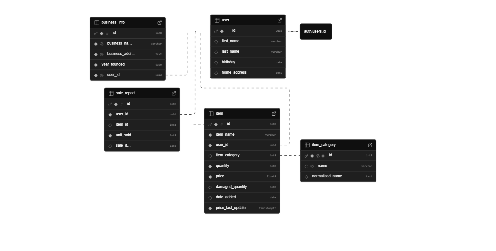
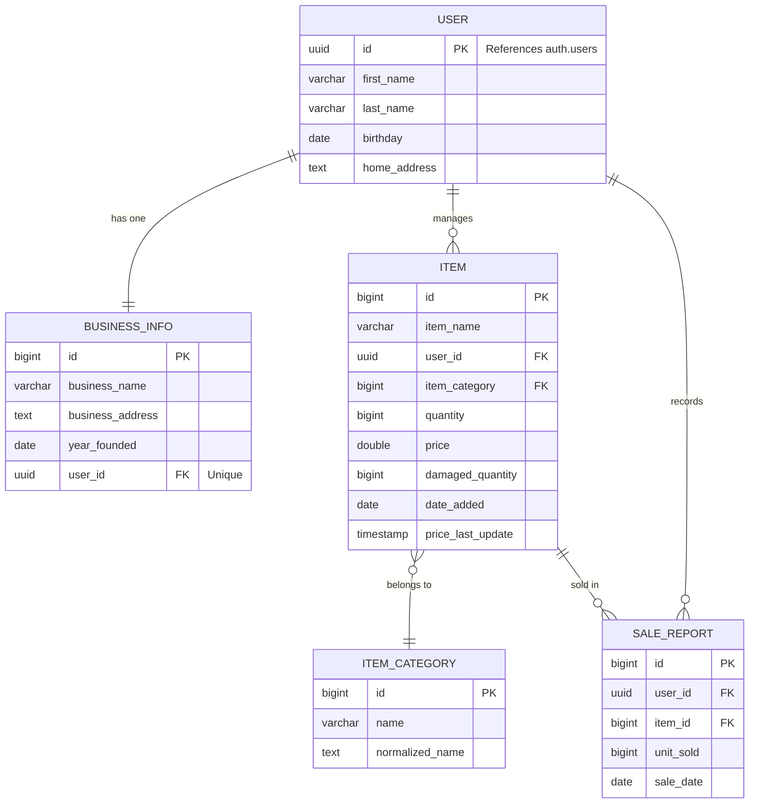

# Invex Database Design

## Introduction
Invex is a web-based inventory management system designed to help small business owners track their stock, manage product pricing, and analyze sales performance. This document details the design of the underlying PostgreSQL database (hosted on Supabase) that powers the application. It covers the database's purpose, the scope of its data model, a detailed breakdown of entities and relationships, and a discussion of design decisions regarding optimizations and known limitations.

## Purpose
The primary purpose of the Invex database is to provide a persistent, relational store for business operational data. Unlike simple spreadsheet solutions, this database ensures data integrity, supports concurrent access, and enables complex querying for reporting purposes.

Specifically, the database is designed to:
1.  **Centralize Inventory Data**: Maintain a single source of truth for product quantities, prices, and categorization.
2.  **Track Business Identity**: Store profile and business details for users, linking them securely to their authentication credentials.
3.  **Record Transactions**: Log sales events to facilitate revenue analysis and stock deduction.
4.  **Ensure Data Integrity**: Use foreign keys and constraints to prevent orphaned records (e.g., sales without items) and invalid states (e.g., negative prices).

## Scope
The database schema is scoped to support the core functionalities of a single-owner business model.

### In Scope
*   **User Management**: Storing extended profile data for users authenticated via Supabase Auth.
*   **Business Profiles**: Managing the details of the business entity associated with each user.
*   **Inventory Management**: CRUD (Create, Read, Update, Delete) operations for items, including tracking damaged goods.
*   **Categorization**: Organizing items into standardized categories.
*   **Sales Reporting**: Logging individual sales transactions with date and quantity.

### Out of Scope
*   **Multi-User Businesses**: The current schema assumes a 1:1 relationship between a user and a business. It does not support multiple employees managing the same inventory.
*   **Supplier Management**: There is no entity for tracking suppliers or purchase orders; inventory is added directly.
*   **Customer CRM**: Sales are anonymous; customer details are not tracked.
*   **Historical Inventory Snapshots**: The database tracks *current* stock. It does not store a daily history of stock levels (though this can be derived partially from sales logs).

## Entities
The database consists of five primary entities in the `public` schema.

### 1. `public.user`
This table acts as an extension to the Supabase `auth.users` table. While Supabase handles authentication (email/password), this table stores application-specific user details.
*   **`id` (UUID)**: The Primary Key. It is a foreign key explicitly linked to `auth.users.id`, ensuring a tight coupling between the auth identity and the profile data.
*   **Attributes**: `first_name`, `last_name`, `birthday`, `home_address`.

### 2. `public.business_info`
Represents the business entity managed by the user.
*   **`id` (BigInt)**: A unique identifier for the business record.
*   **`user_id` (UUID)**: A foreign key linking to `public.user`. It has a `UNIQUE` constraint, enforcing the rule that one user can own only one business profile in this version of the system.
*   **Attributes**: `business_name`, `business_address`, `year_founded`.

### 3. `public.item`
The central entity of the application, representing a product in the inventory.
*   **`id` (BigInt)**: Unique identifier for the item.
*   **`user_id` (UUID)**: Identifies the owner of the item. This allows multiple users to use the platform in isolation (multi-tenancy via row-level security or query filtering).
*   **`item_category` (BigInt)**: A foreign key to the `item_category` table, normalizing the category data.
*   **`quantity` & `damaged_quantity`**: Integers tracking available and unsellable stock.
*   **`price_last_update`**: A timestamp used to track when pricing strategies were last adjusted.

### 4. `public.item_category`
A lookup table for standardizing item types (e.g., "Electronics", "Clothing").
*   **`normalized_name`**: A text field storing a standardized version of the category name (e.g., lowercase, trimmed) to facilitate case-insensitive searching and prevent duplicate categories like "Shoes" and "shoes".

### 5. `public.sale_report`
A transaction log recording sales events.
*   **`item_id` (BigInt)**: Links the sale to the specific product.
*   **`unit_sold`**: The quantity deducted from inventory.
*   **`sale_date`**: The date of the transaction.

## Relationships
The entity relationship diagram below illustrates the connections between these tables.

### Key Relationships Explained
*   **User to Business Info (1:1)**: The `user_id` in `business_info` is both a Foreign Key and marked `UNIQUE`. This enforces a strict one-to-one relationship, simplifying the logic for retrieving "my business" details.
*   **User to Item (1:N)**: A user can create many items, but an item belongs to exactly one user. This is crucial for the multi-tenant nature of the application, ensuring users only see their own inventory.
*   **Item to Category (N:1)**: Many items can belong to one category. This normalization reduces data redundancy. If a category name needs to change (e.g., "Cell Phones" to "Mobile Devices"), it only needs to be updated in one place.
*   **Item to Sale Report (1:N)**: An item can appear in many sales records. This allows for granular reporting on how specific items perform over time.

## Optimizations

### Data Normalization
The database is designed with normalization principles (up to 3NF) to reduce redundancy and improve data integrity.
*   **Categories**: By extracting categories into `item_category`, we avoid storing repeated string values in the `item` table. This saves storage space and prevents spelling inconsistencies.
*   **User Data**: Separating `business_info` from `user` allows for cleaner logical separation. If the application expands to allow users to own multiple businesses in the future, the schema can be adapted by removing the `UNIQUE` constraint on `business_info.user_id` without altering the `user` table.

### Indexing and Keys
*   **Primary Keys**: All tables use `id` as a primary key (either `UUID` or `BigInt`), which is automatically indexed by PostgreSQL. This ensures O(1) access times for looking up specific records.
*   **Foreign Keys**: Foreign keys are used extensively (`user_id`, `item_category`, `item_id`) to enforce referential integrity. While PostgreSQL does not automatically index foreign keys, they are essential for the `JOIN` operations used in generating reports (e.g., joining `sale_report` with `item` to get product names).
*   **Search Optimization**: The `item_category` table includes a `normalized_name` column. This is a pre-computed value (likely populated via application logic or triggers) that allows for efficient, case-insensitive searching without the performance penalty of applying functions like `LOWER()` to the `name` column during every query.

### Data Types
*   **`BigInt`**: Used for IDs and quantities. While standard `Integer` might suffice for small businesses, `BigInt` future-proofs the application against overflow issues as transaction volumes grow.
*   **`UUID`**: Used for user IDs to maintain compatibility with Supabase Auth and to provide globally unique identifiers that are secure against enumeration attacks.

## Limitations

### Scalability of Reporting
The `sale_report` table is a transactional log. As the number of sales grows into the millions, calculating aggregate reports (e.g., "Total Revenue for 2024") by summing rows in real-time will become slow.
*   *Future Improvement*: Implement materialized views or summary tables that pre-calculate daily or monthly totals.

### Historical Data Integrity
The `sale_report` links to `item` via a foreign key. If an item is deleted from the inventory, the database must either cascade the delete (wiping out sales history) or forbid the delete.
*   *Current Constraint*: The schema implies standard foreign key behavior.
*   *Future Improvement*: Implement "soft deletes" (e.g., an `is_deleted` boolean flag on the `item` table) so that items are removed from the UI but remain in the database to preserve historical sales data.

### Pricing History
The `item` table stores only the *current* price and `price_last_update`. It does not track the history of price changes. This means that if an item's price changes today, a sales report generated for last month might inaccurately reflect revenue if it relies on the current price from the `item` table rather than a snapshot of the price at the time of sale.
*   *Mitigation*: The `sale_report` table currently stores `unit_sold` but relies on joining `item` for price. A robust fix would be to add a `price_at_sale` column to `sale_report` to freeze the price at the moment of transaction.

### Single-User Business Model
The strict 1:1 relationship between `user` and `business_info` limits the application's utility for larger businesses with multiple staff members.
*   *Future Improvement*: Introduce a `business_members` junction table to allow multiple users to be associated with a single business ID with varying permission levels.
